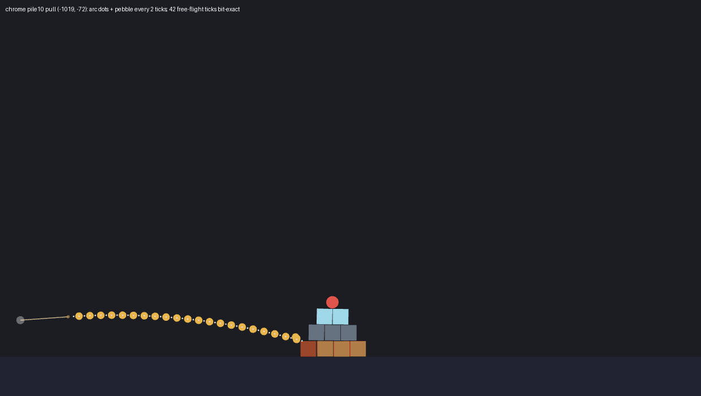
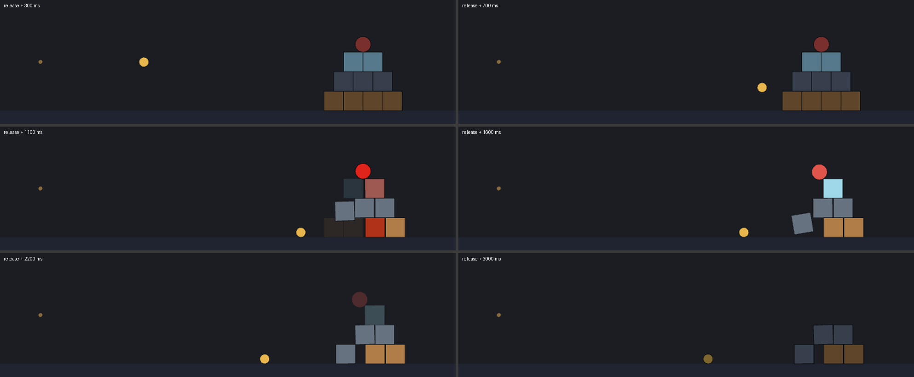
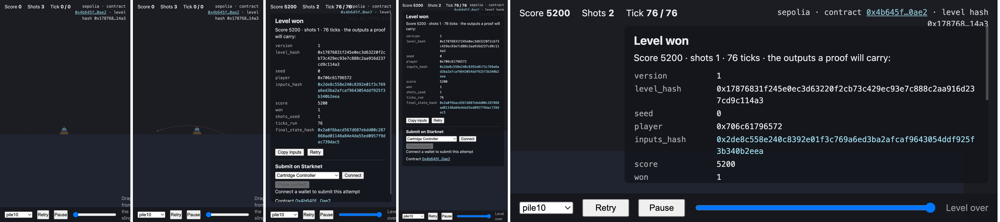
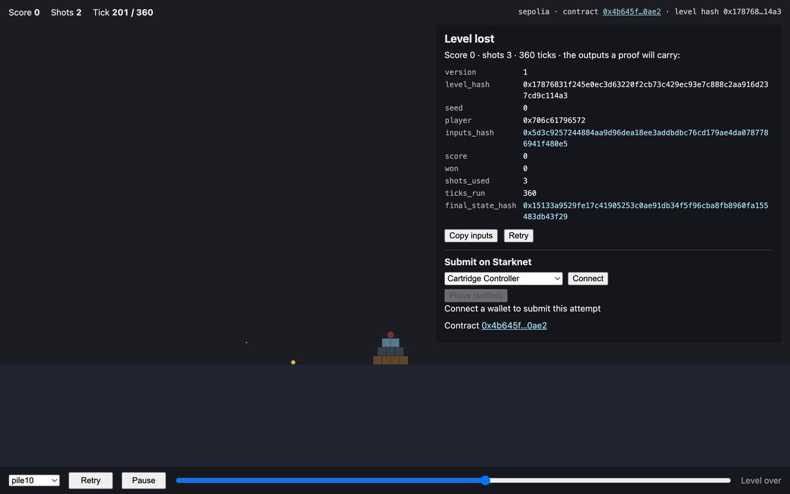

# QA report: the Slingfall client on a Mac (2026-09-26/27)

First run of the client in real browsers (the executors' sandboxes never launched one). Phases 1-2
tested `main` = `d401cf2` (C2 merged, exact substepped arc, rapier2d alpha.3); lot B3 (#29, rapier2d
alpha.5, outputs bit-identical, Sepolia re-pinned) landed during the session, and phase 3's second
attempt ran on `b9b71b3`. The hosted site
(`https://bal7hazar.github.io/slingfall/`) was deployed from `d401cf2` (CI `workflow_dispatch`,
2026-09-26 20:21 UTC; its bundle carries C2's `71582788n / 4n` substep). Contract under test:
`0x4b645fe7cf06775c99c61148097b3aecabb67eacfd2937e0431affef5000ae2` on Starknet Sepolia.

**Verdict.** The Cairo replay runs in every browser engine tried (Chrome 154, Firefox 148/155,
WebKit 26.4) and is **bit-exact**: the owner's pile10 shot and the eight golden cases give the
expected 10 output felts in every engine, and the aim arc equals the VM's free flight tick for tick.
Nothing blocks a tester. The defects are about presentation, resources and operations: the result
panel and the next shot come before the playback has shown the end of the current one, the worker's
wasm peaks at 611 MB (not the documented 300-350 MB), aiming is very coarse (and barely possible on a
phone), and on the proving side an hour of Atlantic was lost because the contract was re-pinned to a
new `c1main` during the run and nothing checks the program hash before proving (M6, M7).

## Contents

1. [Environment](#environment)
2. [Method](#method)
3. [Phase 1: hosted client](#phase-1-hosted-client)
4. [Phase 2: local client](#phase-2-local-client)
5. [Phase 3: prove and settle](#phase-3-prove-and-settle)
6. [Defects](#defects)
7. [Measurements](#measurements)
8. [Suggestions](#suggestions)

## Environment

| item | version / value | note |
|---|---|---|
| machine | Apple M2 Max, 12 cores, 64 GB, macOS 26.6.2 (25G83), arm64 | display rAF 60 or 120 Hz (ProMotion) |
| Node | 24.16.0 / npm 11.13.0 (asdf install, put first on `PATH`) | the asdf **global** is 22.22.2: the repository's `.tool-versions` pins no Node, so a tester who just runs `npm ci` gets Node 22 (minor m7) |
| scarb / snforge | 2.19.4 / 0.61.0 (asdf, equal to `.tool-versions`) | |
| Rust | rustup 1.29.1, stable 1.97.1; `client/vm/runner` uses its pinned 1.89.0 + wasm32 | `build.sh` installed `wasm-bindgen-cli` 0.2.100 with `cargo install` (no macOS binary download) |
| Python | 3.11.6 | Pillow for the report images only |
| Chrome | 154.0.8037.57 (installed Google Chrome, driven through Playwright with fresh profiles) | also a first manual look in the Claude app's built-in browser (Chromium 152) |
| Firefox | **155.0.1** official (installed with Homebrew during the session, with the owner's consent) and 148.0.2 (Playwright's patched build, already cached) | see M1: the 148 build is ~9x slower on wasm and is not representative |
| WebKit | 26.4 (Playwright build; stand-in for Safari) | |
| Brave | installed, not tested | |
| wallets (Chrome default profile) | Braavos 4.19.6, Ready (ex Argent X) 5.33.13; Cartridge Arcade app installed | MetaMask and Phantom also present (irrelevant) |
| browser driver | Playwright 1.59.1 from the npx cache (its Chromium / Firefox / WebKit builds were already installed: nothing downloaded) | |

## Method

The harness is committed under [`docs/qa/harness/`](harness/) (raw outputs were kept out of git):

- `qa.mjs` drives a browser through Playwright. An init script (before the page's own scripts)
  records the console with timestamps, every message of the VM worker (frames, events, chunk
  reports), every `requestAnimationFrame`, the HUD text and the "simulating…" flag over time.
  Scenarios: `load` (cold loads in fresh contexts), `shots` (the page's own `?autoshot=` with exact
  pulls, per shot: release → first frame, ticks, steps, VM time, playback time, fps, slow-motion time,
  wasm peak, outputs, panel timing), `arc` (aims **with the mouse** like a player, screenshots the
  dotted arc, releases, compares the arc with the pebble's frames bit for bit, then scrubs the
  playback to photograph the pebble every 2 ticks).
- `qa-lib.mjs` is the client's own `aim/`, `render/camera` and `trace/lines` code bundled by
  `build-lib.sh`, so the arc, camera and pull mapping used for the checks are the code under test.
- `ui.mjs` (level selector, hashes, Copy inputs, Retry, Play/Pause/scrub, second shot during the
  playback, panel timing), `mobile.mjs` (Chrome's iPhone 13 / Pixel 7 emulation with touch
  events), `memory.mjs` (one tab, repeated play), `summ.py` / `table.py` / `composite.py` (tables and
  images).
- Expected outputs: `fixtures/golden/<case>.json` (the page's default player is `'player'`, the
  goldens' too, so all 10 felts must be equal) and, for the owner's shot, score 5300, 106 ticks,
  `final_state_hash` `0x52d1076e…b673`.
- Memory: RSS of the browser's process tree (`ps`), the renderer / content process that hosts the
  tab and its worker, and the page's own `wasm … MB` figure (the worker's linear memory).
- Timings are on an idle M2 Max unless said otherwise; Firefox 148 figures were taken with the
  Playwright build (M1).

## Phase 1: hosted client

### Checks

| check | Chrome 154 | Firefox 155 (official) | Firefox 148 (Playwright build) | WebKit 26.4 |
|---|---|---|---|---|
| page loads, VM loads ("VM not built" absent) | ✅ `vm: loaded in 471-923 ms` | ✅ 332-335 ms (`browser-check.py`, local `dist/`) | ✅ 2.0-2.2 s | ✅ 461-466 ms |
| cold load → playable | 0.73-1.88 s | – | 2.7-3.5 s | 0.73-0.82 s |
| release → first frame | 25-66 ms | 76-78 ms | 173-555 ms | 28-64 ms |
| owner's shot pile10 (-1022, -63) | ✅ 5300, 106 ticks, `0x52d1076e…b673` | ✅ same | ✅ same | ✅ same |
| six levels, golden outputs (8 cases) | ✅ 10/10 felts each | ✅ pile10 reference (browser-check) | ✅ 10/10 felts each | ✅ 4 cases |
| playback smoothness | ✅ 60/120 fps, worst frame 17.7 ms, 0 frames > 50 ms | – (headless) | ✅ 120 fps rAF, but the whole shot is slow motion (VM-bound) | ✅ 60 fps, 0 frames > 50 ms |
| aim arc on the flight until first contact | ✅ bit-exact (7 aims, 6 levels) | – | ✅ bit-exact (3 aims) | – |
| slow-motion impact ("simulating…") | ✅ 1.4 s of 2.5 s on the owner's shot, 1.7 s on tower | – | ✅ (almost the whole shot) | ✅ |
| damage flashes, destroyed fade-outs | ✅ ([image 02](img/02-impact-sequence-pile10-owner.png)) | – | ✅ | ✅ |
| HUD (score, shots, tick) | ⚠️ m2 (shots left lags), otherwise ✅ | – | ✅ same | ✅ |
| Copy inputs | ✅ `Copied`, JSON `{player, shots:[{pull_x,pull_y,delay}]}` | – | – | – |
| Voyager links (strip and panel) | ✅ `sepolia.voyager.online/contract/0x4b64…`, `_blank`, `noopener`; the page renders the contract | – | – | – |
| level selector (6 levels) | ✅ each loads in ~0.31 s; the strip's hash equals `deploy/sepolia.json` for all six | – | – | – |
| Retry, Play/Pause, Space, scrub | ✅ (m3: label says "Pause" when idle) | – | – | – |
| result panel timing | ❌ M2: shown up to 3 s before the playback ends | – | ✅ (the VM is the bottleneck) | ❌ same as Chrome |
| next shot while the previous one still plays | ❌ M3 | – | – | – |
| mobile viewport (iPhone 13, Pixel 7, landscape) | ⚠️ M5, m1 | – | – | – |
| console errors / HTTP errors | none / none | none | 3 WebGL warnings (m6) | none |

On-chain side (read with starknet.js from the public RPC): `verifier()` = 2 (Satellite); the six
level hashes of `deploy/sepolia.json` are registered and active; `leaderboard(pile10)` =
`[(0x59b1…3753, 5200)]` (the deployment account's settled record).

### Shots

One row per shot. "VM time" is release → last frame produced by the worker; "playback" is release →
last tick shown; "slow motion" is how long "simulating…" was displayed. Chrome and WebKit are the
hosted site; Firefox 148 too (the Playwright build, see M1).

| browser | case | pull | level result | vs expected | shot | first frame | ticks | Cairo steps | VM time | playback | slow motion | wasm peak |
|---|---|---|---|---|---|---:|---:|---:|---:|---:|---:|---:|
| Chrome 154 | **pile10 owner** | -1022,-63 | won, 5300, 1 shot, 106 ticks | owner: 5300 / 106 / 0x52d1…b673 ✅ | 0 | 57 ms | 106 | 15.89M | 2.39 s | 2.51 s | 1.41 s | 611 MB |
| Chrome 154 | pile10-reference | -604,-392 | won, 5200, 1, 107 | golden 10/10 ✅ | 0 | 57 ms | 107 | 10.67M | 1.69 s | 1.84 s | 0.08 s | 611 MB |
| Chrome 154 | cores3-reference | -653,-304 | won, 11050, 1, 180 | golden 10/10 ✅ | 0 | 41 ms | 180 | 14.23M | 2.07 s | 3.04 s | 0.04 s | 290 MB |
| Chrome 154 | tower-reference | -604,-392 | won, 6200, 1, 180 | golden 10/10 ✅ | 0 | 50 ms | 180 | 26.01M | 3.79 s | 3.88 s | 1.75 s | 611 MB |
| Chrome 154 | bridge-reference | -463,-552 | won, 6250, 1, 180 | golden 10/10 ✅ | 0 | 50 ms | 180 | 12.29M | 1.87 s | 3.06 s | 0.06 s | 306 MB |
| Chrome 154 | twin-reference | -503,-327 | won, 4200, 2, 306 | golden 10/10 ✅ | 0 | 58 ms | 126 | 16.15M | 2.45 s | 2.62 s | 0.83 s | 611 MB |
| Chrome 154 | twin-reference | -543,-472 | | | 1 | 52 ms | 180 | 11.47M | 1.76 s | 3.16 s | 0.00 s | 611 MB |
| Chrome 154 | one_block-miss | -150,-150 | lost, 0, 1, 120 | golden 10/10 ✅ | 0 | 25 ms | 120 | 3.12M | 0.53 s | 2.04 s | 0.03 s | 278 MB |
| Chrome 154 | pile10-three-shots | -150,-150 | won, 1200, 3, 349 | golden 10/10 ✅ | 0 | 56 ms | 120 | 5.17M | 0.88 s | 2.07 s | 0.08 s | 290 MB |
| Chrome 154 | pile10-three-shots | -200,-200 | | | 1 | 56 ms | 120 | 5.00M | 0.85 s | 3.19 s | 0.00 s | 290 MB |
| Chrome 154 | pile10-three-shots | -600,-392 | | | 2 | 55 ms | 109 | 11.32M | 1.82 s | 4.16 s | 0.00 s | 611 MB |
| Firefox 148* | **pile10 owner** | -1022,-63 | won, 5300, 1, 106 | owner ✅ | 0 | 532 ms | 106 | 15.89M | 22.67 s | 22.76 s | 22.44 s | 611 MB |
| Firefox 148* | pile10-reference | -604,-392 | won, 5200, 1, 107 | golden 10/10 ✅ | 0 | 531 ms | 107 | 10.67M | 16.03 s | 16.11 s | 15.57 s | 611 MB |
| Firefox 148* | cores3-reference | -653,-304 | won, 11050, 1, 180 | golden 10/10 ✅ | 0 | 350 ms | 180 | 14.23M | 19.61 s | 19.71 s | 19.30 s | 290 MB |
| Firefox 148* | tower-reference | -604,-392 | won, 6200, 1, 180 | golden 10/10 ✅ | 0 | 466 ms | 180 | 26.01M | 36.17 s | 36.24 s | 35.80 s | 611 MB |
| Firefox 148* | bridge-reference | -463,-552 | won, 6250, 1, 180 | golden 10/10 ✅ | 0 | 470 ms | 180 | 12.29M | 17.65 s | 17.75 s | 17.06 s | 306 MB |
| Firefox 148* | twin-reference | -503,-327 / -543,-472 | won, 4200, 2, 306 | golden 10/10 ✅ | 0, 1 | 555, 497 ms | 126, 180 | 16.15M, 11.47M | 23.09, 16.53 s | 24.03, 16.63 s | 23.69, 15.27 s | 611 MB |
| Firefox 148* | one_block-miss | -150,-150 | lost, 0, 1, 120 | golden 10/10 ✅ | 0 | 173 ms | 120 | 3.12M | 4.52 s | 4.63 s | 4.12 s | 278 MB |
| Firefox 148* | pile10-three-shots | 3 pulls | won, 1200, 3, 349 | golden 10/10 ✅ | 0-2 | 528-546 ms | 120, 120, 109 | 5.17M, 5.00M, 11.32M | 8.09, 7.89, 16.93 s | – | – | 611 MB |
| **Firefox 155** | **pile10 owner** (`browser-check.py`) | -1022,-63 | won, 5300, 1, 106 | ✅ | 0 | 76 ms | 106 | 15.89M | **3.33 s** | – | – | 611 MB |
| **Firefox 155** | pile10 (-600,-392) (`browser-check.py`) | -600,-392 | won, 5200, 1, 109 | – | 0 | 78 ms | 109 | 11.30M | **2.46 s** | – | – | 611 MB |
| WebKit 26.4 | **pile10 owner** | -1022,-63 | won, 5300, 1, 106 | owner ✅ | 0 | 64 ms | 106 | 15.89M | 2.53 s | 2.65 s | 1.63 s | 611 MB |
| WebKit 26.4 | cores3-reference | -653,-304 | won, 11050, 1, 180 | golden 10/10 ✅ | 0 | 46 ms | 180 | 14.23M | 2.30 s | 3.05 s | 0.06 s | 290 MB |
| WebKit 26.4 | one_block-miss | -150,-150 | lost, 0, 1, 120 | golden 10/10 ✅ | 0 | 28 ms | 120 | 3.12M | 0.57 s | 2.02 s | 0.03 s | 278 MB |
| WebKit 26.4 | pile10-three-shots | 3 pulls | won, 1200, 3, 349 | golden 10/10 ✅ | 0-2 | 56-63 ms | 120, 120, 109 | 5.17M, 5.00M, 11.32M | 0.93, 0.89, 1.88 s | 2.07, 3.15, 4.07 s | 0.09, 0, 0 s | 611 MB |

\* Playwright's Firefox build, see M1.

Outputs of the owner's shot (all engines):
`inputs_hash 0x6dd07fd191c8814fff72b40789481928a97552cf7dc8aa03d67c1bcd58c4d5e`,
`final_state_hash 0x52d1076e0dc51f1c02fd74481aeeacd930f79fa4a99f075f70ee1b5487ab673`, score 5300,
won, 1 shot, 106 ticks ([image 03](img/03-end-panel-pile10-owner.png)).

### Aim arc against the actual flight

Aimed with the mouse at 1280×800 (14.16 px per metre, so **24.1 pull units per CSS pixel**: the
wanted pull is only reachable to the nearest pixel, and the pull the harness predicted from the
pixel was the pull the page released in all 7 cases). The arc (BigInt, `flightArc`) is compared with
the pebble's frames streamed by the Cairo VM:

| level | wanted pull | pull the mouse gave | arc dots | free-flight ticks bit-exact | first contact (damage) tick | last dot vs frame (m) |
|---|---|---|---:|---:|---:|---|
| pile10 (owner direction) | (-1022, -63) | (-1019, -72) | 43 | 42 | 43 | tick 43: dx -0.297, dy +0.115 |
| pile10 (lob) | (-500, -700) | (-489, -699) | 120 | 120 | – | none in 120 ticks |
| cores3 | (-653, -304) | (-658, -313) | 79 | 78 | 79 | tick 79: dx -0.160, dy +0.054 |
| tower | (-604, -392) | (-609, -386) | 78 | 77 | 78 | tick 78: dx -0.122, dy +0.020 |
| bridge | (-463, -552) | (-465, -554) | 120 | 120 | – | none in 120 ticks |
| twin | (-503, -327) | (-513, -337) | 77 | 76 | 77 | tick 77: dx -0.089, dy +0.101 |
| one_block | (-600, -392) | (-609, -386) | 111 | 110 | – (touches without damage) | tick 111: dx -0.095, dy +0.202 |

Every dot before the contact tick is the pebble's position **bit for bit**; the last dot (the first
inside a body's box, kept on purpose: "where the pebble arrives") is off by 0.1-0.3 m, the contact
itself. Firefox gives the same table for its three aims. Images: the arc (aim screenshot) lightened
with the pebble every 2 ticks: [owner direction](img/04-arc-vs-flight-chrome-pile10-owner.png),
[lob](img/04-arc-vs-flight-chrome-pile10-lob.png), [cores3](img/04-arc-vs-flight-chrome-cores3.png),
[tower](img/04-arc-vs-flight-chrome-tower.png), [cores3 in Firefox](img/04-arc-vs-flight-firefox-cores3.png).



### Impact presentation



Owner's shot, release + 0.3 … 3.0 s (Chrome): damaged bodies flash red, destroyed ones fade at their
last pose, the core disappears, "simulating…" is shown while the playback waits for the VM (1.4 s of
the 2.5 s). The spent pebble stays drawn on the ground, dimmed, after the shot (m4).

### Mobile viewport

Chrome device emulation, touch events (CDP `Input.dispatchTouchEvent`); a touch drag aims and fires
(pull (-979, -293) wins pile10: 5200, 76 ticks, 1.64 s of VM).

| device | viewport | px per metre | full pull (3 m) | grab radius (1.5 m) | pull units per px | layout |
|---|---|---:|---:|---:|---:|---|
| iPhone 13 | 390×664 | 6.11 | 18 px | 9 px | 56 | hint wraps to 6 lines and leaves the viewport; HUD runs into the chain strip after the shot |
| Pixel 7 | 412×839 | 6.46 | 19 px | 10 px | 53 | same |
| iPhone 13 landscape | 750×342 | 5.55 | 17 px | 8 px | 61 | result panel covers the whole scene (scrolls: 514 px of content in 242 px) |



## Phase 2: local client

`cd client && npm ci && npm run lint && npm test && npm run build:sepolia && npm run dev:sepolia`,
Node 24.16.0:

| step | result | time |
|---|---|---:|
| `npm ci` | 251 packages, 0 vulnerabilities | 14 s |
| `npm run lint` | clean (ESLint + `tsc --noEmit`) | 2.9 s |
| `npm test` before the wasm | 16 files passed, 1 skipped (`vm.test.ts`); 186 tests passed, 8 skipped | 1.1 s |
| `client/vm/scripts/build.sh` | `pkg/` and `pkg-node/` built, wasm 1 524 958 B; cairo-vm `f7ac327f` vendored and patched; `wasm-bindgen-cli` 0.2.100 compiled by `cargo install` (macOS: no prebuilt download) | 1 min 35 s |
| `npm test` with the wasm | 17 files, **194 tests passed** | 21.8 s |
| `npm run build:sepolia` | ok (`dist/` 23 MB, of which `dist/vm/` 21 MB); warnings: direct `eval` in `@starknet-io/get-starknet` and `@cartridge/controller`, a chunk > 500 kB (m8) | 2.7 s |
| `npm run smoke:sepolia` | `ok (/assets/index-CG2cwnC8.js carries 0x4b645f…0ae2)` | – |
| `npm run dev:sepolia` | Vite 8.3.1 ready in 81 ms, `vm: loaded in 312-348 ms` | – |

Repeated on `http://localhost:5173` (Chrome 154, same harness): cold load → playable 0.60-0.61 s
(`vm: loaded` 322-324 ms); the owner's shot and the eight golden cases give the same outputs and
figures as the hosted site (first frame 24-63 ms, owner's shot 2.51 s, tower 3.99 s); level hashes,
Copy inputs, Retry, the panel timing (2.9 s early) and the second-shot-during-playback behaviour are
identical; no console or HTTP errors.

**`client/vm/scripts/browser-check.py`** (its first run anywhere), headless, on `client/dist/`:

| Firefox | pull | `vm: loaded` | `init` | first frame | shot (VM) | outputs | wall | exit |
|---|---|---:|---:|---:|---:|---:|---:|---|
| 155.0.1 official | (-600, -392) default | 332 ms | 105 ms | 78 ms | 109 ticks, 11.30M steps, **2.46 s** | 33 ms | – | 0, screenshot written |
| 155.0.1 official | (-1022, -63) | 335 ms | 104 ms | 76 ms | 106 ticks, 15.89M steps, **3.33 s**, 5300 | 25 ms | – | 0 |
| 148.0.2 Playwright build | (-600, -392) default | 1 906 ms | 505 ms | 525 ms | 109 ticks, 11.30M steps, 16.66 s | 301 ms | 41.5 s | 0 |

The script works as documented; its console dump is buried under ~400 lines of Firefox's own
`console.debug` (web-compat interventions): a filter on the page's lines would help (suggestion S9).

### Wallet

The owner's everyday Chrome 154 (profile with Braavos 4.19.6 on Sepolia), driven through the Claude in
Chrome extension on `http://localhost:5174` (the same dev server with `VITE_PROVE_URL=http://127.0.0.1:8549`
for phase 3). The owner clicked in the wallet; nothing was signed at this step.

| step | result |
|---|---|
| play pile10 (`?autoshot=-1022,-63`) | won, 5300, 106 ticks, `final_state_hash 0x52d1076e…b673` (same outputs as everywhere else) |
| wallet list | "Browser wallet (get-starknet)" opens get-starknet's modal: **Braavos** detected; Ready X shows as "Install Argent X" because the extension is disabled in that Chrome profile (not a page defect) |
| Connect | `Connected 0x59b1a0…3753` (the deployment account); **Prove (settled)** becomes active (Satellite deployment, prover URL set) |
| network | the top strip shows `sepolia · contract 0x4b645f…0ae2 · level hash 0x178768…14a3`; the panel itself does not name the network |
| contract | `Contract 0x4b645f…0ae2` → `https://sepolia.voyager.online/contract/0x4b645f…` |
| player's LevelValidated | `your LevelValidated: 0x636874…50eb` → Voyager tx, the deployment's settled record (block 15 668 002); it appears **~26-40 s** after Connect (m10) |

Two observations from this run: the panel keeps showing the outputs of the default player
(`player 0x706c61796572`, its `inputs_hash`) under "the outputs a proof will carry", while the proof it
requests is for the connected account (m11); and in that Chrome profile the VM ran ~4.5x slower than in a
clean profile (m12).

## Phase 3: prove and settle

Run with the owner's consent. Keys: the owner put `ATLANTIC_API_KEY` (and a Sepolia account) in the
environment of the machine's Claude sessions themselves; nothing was written to the repository or printed.
The service ran with **`--no-translate`**, so the only transaction of the run is the owner's own
`Settle` in Braavos.

Builds (M2 Max, from scratch):

| step | command | time |
|---|---|---:|
| Herodotus cairo-vm fork, patched for cairo-lang 2.19.4 | `docs/proving.md` "Reproduce": clone `da8e48c6`, `git apply`, `cargo +stable build -p cairo1-run --release` | 3 s + 190 s |
| `c1main` | `scarb --manifest-path tools/atlantic/c1main/Scarb.toml build` (91 MB Sierra) | 17 s |
| `tools/prove` (Stwo, not used by the service) | `STWO_JOBS=8 tools/prove/setup.sh` (installs `nightly-2025-06-23`) | 237 s |
| dry run of the service | `prove_service.py prove --level pile10 --player 0x59b1…3753 --shot=-1022,-63 --no-submit` | 97 s: 13 976 709 steps, 67 MB PIE, outputs = the browser's (5300, 106, `0x52d1…b673`), `child_program_hash 0x674479c2…cf99` = the deployment's |

Transcript (UTC, 2026-09-27):

| time | event |
|---|---|
| 07:36:42 | `prove_service.py serve --no-translate` on 127.0.0.1:8549 (`STARKNET_RPC_URL` = the public node) |
| 10:32 | owner's Chrome, `http://localhost:5174/?level=pile10&autoshot=-1022,-63`: won, 5300 |
| 10:33-10:59 | Braavos connected (the owner approved in the wallet): `0x59b1a0…3753` |
| 10:59:35 | **Prove (settled)** clicked: `POST /prove` → job `72ca36a9023f98ee2c47ad252e161e24`; panel: "Proof requested for 0x59b1a0…3753; this takes about 1.5 h, keep this page open", tier "Proving · preparing the proof (running)" |
| 11:01:22 | PIE built (`cairo1-run` 100.1 s, 13 976 709 steps, 67 MB) and submitted: Atlantic query **`01M3H8DFEX7E8C2Y4BFTH7DT9Y`**, declared size L (Atlantic reports M), `PROOF_VERIFICATION_ON_L2`; facts: integrity `0x5afb250d…e23f`, SHARP `0x7c36ed86…d9d3` |
| 11:03:39 | `TRACE_AND_METADATA_GENERATION` completed (136.6 s) |
| 11:03:40 | `PROOF_GENERATION_AND_VERIFICATION` started |
| 11:56:15 | SHARP proof + L1 verification completed (**3 154.9 s**); `BRIDGE_FACT_HASH` started; Atlantic's facts = the service's |
| 12:00:41 | bridge completed (Atlantic `DONE`, ~4.4 min); `/status`: `settleable_keccak: true`; the page: "Proving · proof on Starknet (Satellite): ready to settle" and a **Settle** button |
| ~12:05 | owner clicks **Settle**: Braavos's fee estimation fails, nothing is sent (below) |

**First attempt failed: the contract had been re-pinned to another program during the run.** The
estimation of `submit_settled` reverted with `'submit: proof'`:

```
RpcError: RPC: starknet_estimateFee … 41: Transaction execution error: … Contract address=
0x4b645fe7cf06775c99c61148097b3aecabb67eacfd2937e0431affef5000ae2, Class hash=
0x46bff3841120701543560f801b66ad9f9eb35dd73484d2cf0422be533442e5f, Selector=
0x33f99ee0ab958f69ce0817ccdbdf039178fca067366afc163fc9513dec924f7, Nested error:
0x7375626d69743a2070726f6f66 ('submit: proof')
```

Diagnosis (read-only calls): the calldata's level felts equal the proven ones (`level_data` = the 146
felts of the proof's input), but `satellite_config().child_program_hash` on chain was
`0x3f961b5c…d27ec`, not the deployment's `0x674479c2…cf99`. A binary search on the storage over blocks
found the change: **tx `0x1f3652885aec68ea61add59bb3814dbd44e55669f8e5727d74c347dc28a1447`, block
15 709 781, 2026-09-27 08:51:32 UTC**, `set_satellite_config` from the admin account: lot **B3** (#29,
rapier2d alpha.5, merged 09:13 UTC) re-pinned the contract to alpha.5's `c1main`. This QA checkout was
`d401cf2` (alpha.3), so the service proved alpha.3's `c1main`: a valid fact on the Satellite, for a
program the contract no longer accepts. Per the brief the run stopped there; no transaction was sent,
the attempt stayed `NONE` on chain. See M6 and M7.

**Second attempt, on alpha.5** (the owner agreed): the branch rebased on `origin/main` (`b9b71b3`),
`c1main` rebuilt (20 s), then checked **before** asking Atlantic: a `--no-submit` run of the same attempt
gives `child_program_hash 0x3f961b5c…d27ec` = the contract's (124 s, 14 162 423 steps, +1.3 % over
alpha.3, outputs bit-identical: 5300, 106, `0x52d1…b673`); `attempt(pile10, 0x59b1…, 0x5b10ae54…)` = 0,
`best` = 5200 settled.

| time (UTC) | event |
|---|---|
| 12:20:26 | service restarted (alpha.5 `c1main`, `--no-translate`) |
| 12:21-12:22 | page reloaded (alpha.5 executables), won again, Braavos reconnected |
| 12:22:19 | **Prove (settled)**: job `f7ab9022b18ccaacc3b443ecbfa6803f` (same id as the dry run) |

_In progress._

## Defects

Ranked. Each has a reproduction on the hosted site (the local site behaves the same).

### Blocking

None found.

### Major

**M2. The result panel appears before the playback has shown the end of the level.** The panel opens
when the VM finishes the last shot, not when the playback reaches the last tick. On a fast machine the
VM runs ahead of real time on every non-impact tick, so "Level won / lost" (with the score and the
outputs) covers the scene while the last shot is still being shown: 2.9-3.0 s early for a lost 3-shot
game, 2.3 s for the golden 3-shot pile10, 1.5 s for one_block-miss, 1.2 s for bridge, 1.0 s for
cores3 (Chrome 154, WebKit likewise; in Firefox 148 the VM is the bottleneck so the panel lands
with the last frame).
Repro: pile10, three weak shots (e.g. pulls (-150,-150), (-200,-200), (-600,-392), or
`?autoshot=-150,-150;-200,-200;-600,-392`): the panel appears while the HUD still shows tick ~180-270
of 349-360 and "Score 0 · Shots 2" ([image 05](img/05-panel-before-playback-end.png)).



**M3. The sling re-arms when the VM is done, not when the shot has been shown.** After a release,
`stage.armed` comes back as soon as the worker finishes (0.9 s for a 120-tick weak shot) while the
pebble is still flying on screen (tick 50-53 of 120). A second drag fires the next shot; its frames
queue behind the first one's, the hint says "Simulating in Cairo…" for a shot the player cannot see
yet, and the HUD still says "Shots 3" ([image 06](img/06-second-shot-during-playback.png)).
Repro: pile10, pull ≈ (-154,-154), release; as soon as the hint returns to "Drag from the sling to
aim" (~1 s), drag again: `shot 1: release` is logged while the first pebble is mid-air. Together with
M2 this means a fast player can finish a level before seeing it.

**M4. The worker's wasm peaks at 611 MB on every shot with an impact (673-681 MB on alpha.5; documented:
299-349 MB).** The chunk reports show the cause: the flight chunks are sized from the cheap flight
ticks (K = 20, the cap), and the chunk that enters the impact then runs 4.5-6.2M steps (above the 3.5M
target) and needs **5.4-6.8M execution cells** against the 5.00M reserve floor, so the segment doubles
(290 → 611 MB; alpha.5: 352 → 673-681 MB) and wasm memory never shrinks. Seen on pile10 (owner, reference,
3-shot), tower, twin; not on cores3 / bridge / one_block, whose impact chunks stay under 5M cells. The
largest chunks measured: pile10's 3rd shot (-600, -392) 6.70M cells / 6.09M steps, pile10-reference 6.63M
/ 6.04M (alpha.3; +1 % on alpha.5). Tab memory in Chrome after such a shot: renderer 710-810 MB, browser
total ~1.6 GB; in Firefox the content process 614-700 MB. Harmless on this Mac, risky on a phone (iOS
kills tabs well below that). Repro: any pile10 hit; the console line ends with `wasm 611 MB`.

| chunk (owner's shot, Chrome) | ticks | steps | exec cells | reserve | wasm |
|---:|---:|---:|---:|---:|---:|
| 1 | 5 | 0.34M | 0.34M | 5.00M | 290 MB |
| 2 | 20 | 0.64M | 0.70M | 5.00M | 290 MB |
| 3 | 20 | 1.49M | 1.67M | 5.00M | 290 MB |
| **4** | **20** | **4.54M** | **5.38M** | **5.00M** | **611 MB** |
| 5 | 15 | 3.40M | 3.84M | 5.04M | 611 MB |
| 6 | 15 | 3.16M | 3.49M | 5.00M | 611 MB |
| 7 | 16 | 2.31M | 2.49M | 5.00M | 611 MB |

**M5. Aiming is coarse, the sling is hard to find, and on a phone barely usable.** The camera fits
the level's bounds (pile10: 60 × 50 m), so the structure is ~90 px wide in a 1280×800 window and the
sling is the 0.1 m anchor dot (1-3 px), with no band or pebble drawn at rest
([image 01](img/01-hosted-chrome-start-1280x800.png)). A full pull is a 42 px drag and one pixel is
24 pull units (the owner's (-1022, -63) cannot be aimed exactly: the nearest mouse pull is
(-1019, -72), which misses the win: score 50, 180 ticks, 48.75M steps). On an iPhone 13 the full pull
is 18 px, the grab radius 9 px around an invisible point, 56 pull units per px.
Repro: open the page on a phone (or Chrome's device toolbar), try to start a drag on the sling.

**M6. The prover service spends an hour on a proof the contract will refuse, and says "ready to
settle".** Neither the service nor the page compares the service's `c1main` program hash with the
contract's `satellite_config().child_program_hash` before submitting to Atlantic; `/status`'s
`settleable_keccak` only asks the Satellite whether the fact exists, not whether the contract will accept
it. In this run the mismatch surfaced only at Settle, 66 minutes later, as a raw `starknet_estimateFee`
error in the wallet ('submit: proof'). Repro: point the service at a `c1main` whose hash differs from the
contract's (here: alpha.3 against a contract re-pinned to alpha.5), prove, wait, press Settle. A read of
`satellite_config()` at `POST /prove` (and a `submit_settled` simulation before showing Settle) would
fail in a second.

**M7. Re-pinning `child_program_hash` silently invalidates every proof in flight.** The contract accepts
exactly one child program hash; `set_satellite_config` replaced alpha.3's with alpha.5's at 08:51 UTC
while this run's proof (and any player's) was being made or waiting to be settled. B3's outputs are
bit-identical to alpha.3's, yet those proofs can never be settled. Accepting the previous hash for a
grace period (or a set of pinned hashes), and announcing re-pins to running services, would avoid it.

(The former M6, "your LevelValidated", was reclassified as m10 after the wallet run.)

### Minor

- **m1. Phone layout.** Portrait: the hint "Drag from the sling to aim" wraps to 6 lines and
  overflows the 44 px controls bar, out of the viewport (bottom 701 px on a 664 px viewport); after a
  shot the HUD ("Tick 76 / 76") runs into the chain strip ("sepolia · contract …"). Landscape: the
  result panel covers the whole scene and scrolls. [Image 07](img/07-mobile-iphone13-pixel7.png).
- **m2. "Shots" lags.** `hudAt` subtracts `shot_end` events only, so the counter shows 3 while the first
  pebble flies (and after a second release, M3); its doc comment says "a shot in flight is spent".
- **m3. Play/Pause label.** It reads "Pause" when nothing plays (at the end of the playback, after
  Retry, before the first shot).
- **m4. Spent pebble stays drawn.** After a shot the pebble remains on the ground, dimmed (asleep
  tint), until the next shot, although D5 removes it at the end of the shot
  ([image 03](img/03-end-panel-pile10-owner.png), left of the pile).
- **m5. Stale figures in the docs.** `docs/testers.md` ("the pile10 reference shot (191 ticks, 34M
  steps) takes about 10 s") and `client/vm/README.md` ("Reference shot (-600, -392): 191 ticks, won,
  score 5 350") predate rapier alpha.3 / S1: today (-600, -392) is 109 ticks, 11.30M steps, 5200, and
  the golden (-604, -392) 107 ticks, 10.67M steps. `client/README.md` lists `?level=pile10|cores3|one_block`
  (six levels exist).
- **m6. Firefox console warnings** at every load: `WebGL context was lost` (PixiJS's WebGL probe),
  `texImage: Alpha-premult and y-flip are deprecated`, `lazy initialization`. Harmless.
- **m7. Node is not pinned.** `.tool-versions` has scarb and snforge only; with asdf the global Node
  (22 here) runs `npm ci`; `package.json` has no `engines`.
- **m8. Build warnings.** Direct `eval` in `@starknet-io/get-starknet` and `@cartridge/controller`; the
  main chunk is 531 kB (157 kB gzip).
- **m10. "Your LevelValidated" is slow and sometimes missing.** `playerValidations` asks
  `starknet_getEvents` from block 0: on `starknet-sepolia-rpc.publicnode.com` that takes ~26 s (4 of 4
  tries in the afternoon) and failed once in the morning (`-32701 broker: node error` after 30 s, the
  list then never shows, a console warning only). From the deployment's block (15 668 001) the same
  query answers in 50-200 ms. In the page the list appeared 26-40 s after Connect.
- **m11. The panel shows the default player's outputs after Connect.** "The outputs a proof will
  carry" keeps `player 0x706c61796572` and its `inputs_hash`, while Prove (settled) requests the proof for
  the connected account (another `player`, another `inputs_hash`, same score and `final_state_hash`).
  Recompute and redraw the table for the connected account.
- **m12. The VM ran ~4.5x slower in the owner's everyday Chrome profile.** Same Chrome 154, same page,
  same machine on AC power: the owner's profile (13 extensions, among them five wallets, uBlock Origin
  Lite and Dashlane, plus the Claude in Chrome extension driving the tab) gave `vm: loaded` 1 760-1 827 ms,
  `init` 452-598 ms, first frame 285-330 ms and the owner's shot in **10.70-11.60 s** (twice); a clean
  profile gives 2.39-2.64 s, **with or without DevTools open** (measured: DevTools does not slow the
  wasm). Cause not isolated here (another extension, or the driving extension's debugger). Worth a
  check, since every tester of this game has wallet extensions.
- **m9. A cap shot exceeds D10's budget.** The near-owner pull (-1019, -72) runs the 180-tick cap:
  48.75M Cairo steps (7.5 s in Chrome), 1.6x D10's 3e7 per shot; worth a probe for the proving side
  (job size) since players will produce such shots.

### Retracted

**R1 (was M1). Firefox 148's Playwright build runs the VM ~9x slower: not a product defect.** With
the Playwright build of Firefox 148 the VM does 0.7M steps/s against 6.3-6.6M in Chrome 154 and
WebKit 26.4 (owner's shot 22.7 s instead of 2.4 s, tower 36 s, first frame 0.35-0.55 s, `init`
0.5 s, and the whole shot plays in slow motion). The **official Firefox 155** does 4.6-4.8M steps/s
(owner's shot 3.33 s, first frame 76 ms): the client is fine in Firefox. Kept here because the
repository's own Firefox check (`browser-check.py --firefox <Playwright's Nightly>`) and any CI using
Playwright's Firefox would show this 9x factor: measure with a release Firefox.

## Measurements

| figure | Chrome 154 | Firefox 155 | Firefox 148* | WebKit 26.4 | budget / doc |
|---|---:|---:|---:|---:|---:|
| cold load → playable (hosted) | 0.73-1.88 s | – | 2.7-3.5 s | 0.73-0.82 s | – |
| `vm: loaded` (wasm + 3 executables, in the worker) | 0.47-0.92 s (hosted), 0.32 s (local) | 0.33 s | 2.0-2.2 s | 0.46 s | 0.4-0.6 s (Node) |
| `init` (pile10) | 86-93 ms | 104-105 ms | 495-535 ms | 108 ms | 130-211 ms (Node) |
| release → first frame | 25-66 ms | 76-78 ms | 173-555 ms | 28-64 ms | ≤ 0.3 s |
| VM speed | 6.3-6.9M steps/s | 4.6-4.8M steps/s | 0.66-0.72M steps/s | 6.0-6.3M steps/s | 2.5-3.7M (G1b/G1c) |
| playback | 60/120 fps, worst frame 17.7 ms | – | 120 fps (display), VM-bound | 60 fps, worst 19 ms | 60 Hz |
| wasm peak | 278-611 MB | 611 MB | 278-611 MB | 278-611 MB | 299-349 MB |
| tab after 3 shots (pile10) | renderer 807 MB, browser 1.68 GB | – | content 698 MB, browser 1.48 GB | – | – |
| `outputs` | 11-31 ms | 25-33 ms | 103-331 ms | 11-22 ms | 19-21 ms (Node) |

rapier2d alpha.3 (`d401cf2`) against alpha.5 (`b9b71b3`, lot B3), same harness, local site, Chrome 154:
outputs bit-identical in all 9 cases (8 goldens + the owner's shot); Cairo steps +0.6 to +1.6 %; the
worker's wasm +62 MB at every level (290 → 352 MB without impact, 611 → 673-681 MB with one).

| case | shot | steps alpha.3 | steps alpha.5 | Δ steps | VM time a.3 / a.5 | wasm peak a.3 / a.5 |
|---|---:|---:|---:|---:|---:|---:|
| pile10 owner | 0 | 15.89M | 16.07M | +1.1 % | 2.51 / 2.61 s | 611 / 673 MB |
| pile10-reference | 0 | 10.67M | 10.78M | +1.0 % | 1.79 / 1.86 s | 611 / 673 MB |
| cores3-reference | 0 | 14.23M | 14.41M | +1.3 % | 2.19 / 2.29 s | 290 / 352 MB |
| tower-reference | 0 | 26.01M | 26.33M | +1.2 % | 3.99 / 4.13 s | 611 / 673 MB |
| bridge-reference | 0 | 12.29M | 12.43M | +1.1 % | 1.96 / 2.10 s | 306 / 368 MB |
| twin-reference | 0, 1 | 16.15M, 11.47M | 16.31M, 11.57M | +1.0 %, +0.9 % | 2.58, 1.85 / 2.66, 2.00 s | 611 / 681 MB |
| one_block-miss | 0 | 3.12M | 3.14M | +0.6 % | 0.55 / 0.62 s | 278 / 352 MB |
| pile10-three-shots | 0, 1, 2 | 5.17M, 5.00M, 11.32M | 5.20M, 5.03M, 11.44M | +0.6 to +1.1 % | 0.94, 0.90, 1.88 / 0.97, 0.93, 1.94 s | 611 / 673 MB |

Tab memory over repeated play, one fresh Chrome tab on the hosted site (`memory.mjs`: three winning
shots with Retry in between, then a 3-shot game; the worker persists across retries):

| after | renderer RSS | JS heap | worker wasm |
|---|---:|---:|---:|
| load | 378 MB | 5 MB | 125 MB |
| win 1 (pull (-980, -293): 5200, 76 ticks) | 710 MB | 6 MB | 611 MB |
| win 2 | 719 MB | 8 MB | 611 MB |
| win 3 | 725 MB | 9 MB | 611 MB |
| a 3-shot game (1200, 349 ticks) | 760 MB | 5 MB | 611 MB |

The worker plateaus at its first impact (no growth across retries beyond ~15 MB); the whole cost is
M4's doubled segment.

Hosted assets: the page's JS 153 kB gzip; the worker fetches the wasm (570 kB gzip) and the
executables (`step_chunk` 676 kB, `init` 626 kB, `outputs` 38 kB gzip; 10.4 MB decoded for
`step_chunk`), `Cache-Control: max-age=600`.

Shot durations per level (Chrome 154, VM time / playback): pile10 owner 2.39 / 2.51 s; pile10
reference 1.69 / 1.84 s; cores3 2.07 / 3.04 s; tower 3.79 / 3.88 s; bridge 1.87 / 3.06 s; twin
2.45 + 1.76 / 2.62 + 3.16 s; one_block miss 0.53 / 2.04 s.

## Suggestions

- **S1 (M2, M3).** Gate the result panel and `stage.armed` on the playback reaching the last frame of
  the shot (`playback.position >= buffer.frameCount - 1` and not producing), not on the VM's end.
- **S2 (M4).** End the flight chunk at the arc's predicted contact tick (the client computes it
  exactly, `flightArc`'s display cut) so that the impact starts a fresh, small chunk; or raise
  `minReserveCells` to ~7.5M (the worst impact chunk measured needs 6.78M on alpha.5): an estimate from
  `client/vm/README.md`'s ~32 B per reserved cell puts the plateau near 370 MB (alpha.3) / 430 MB (alpha.5)
  instead of 611 / 673 MB. Cutting the chunk at the contact tick keeps the 5M floor and the lower plateau.
- **S3 (M5).** Frame the camera on the sling and the structures (not the level bounds), draw the
  sling (band, resting pebble) at rest, scale the drag to the screen (e.g. full pull = 25-30 % of the
  short side), and offer fine aiming (a modifier key or keyboard nudges of one pull unit).
- **S4 (M6).** Start `getEvents` at the contract's deployment block (from `deploy/sepolia.json`, e.g.
  a `VITE_DEPLOY_BLOCK`), and page from there.
- **S5 (m1).** On narrow screens: hide or shorten the hint, stack the chain strip under the HUD,
  make the result panel collapsible.
- **S6 (m2, m3, m4).** Count a released shot as spent; label the button from `playback.playing &&
  position < lastFrame`; drop the pebble from the last frame of a shot (or fade it).
- **S7 (m5, m7).** Refresh the reference figures in `docs/testers.md` and `client/vm/README.md`; pin
  `nodejs 24.x` in `.tool-versions` and add `"engines": {"node": ">=24"}`.
- **S8 (M1).** Take browser figures with release browsers; if CI ever runs Playwright's Firefox, do not
  compare its VM timings with Chrome's.
- **S9.** `browser-check.py`: print only the page's own console lines (skip Firefox's
  `console.debug` web-compat noise).
- **S10 (latency of the settled tier; the owner finds this wait unacceptable).** Almost all of the
  wait is infrastructure, not proving: SHARP's batch cadence and the L1 verification (~60 min), then the
  bridge (~4 min); the proof itself takes ~1 min on a large machine (P1b: pile10 whole in 55 s, 20.5 GiB;
  K = 16 chunks 21-36 s each, parallelisable) and verifies in ~1.5 s. Until a direct path exists: give the
  player an immediate *provisional* record again (the attested tier of D9; the Sepolia deployment is
  Satellite-only), and let the service **relay** `submit_settled` when the fact lands (the proof already
  binds `player`; today the contract requires `caller == player`, so the player must keep the page open
  about an hour and come back to sign).
- **S11 (programme decision).** A research spike on **direct verification on Starknet** with a target
  latency under 5 minutes: SNIP-36 (needs PROOF2 on Sepolia ~2026-10-08, the simulation class brought under
  the CASM limit, today 5.3x over, via rapier CS1 / CS2, and per-transaction budgets of ~9M steps against 10.7-48.8M per
  shot, i.e. recursive aggregation of the chunk proofs), against local Stwo proofs verified by an on-chain
  verifier (Integrity); cost, RAM and latency of each. Waiting for October alone does not unblock
  SNIP-36.
- **S12 (M6, M7).** At `POST /prove`, the service reads `satellite_config()` and refuses (409, with both
  hashes) when its `c1main` hash differs; `/status` computes `settleable` against the contract's config (or
  simulates `submit_settled`); the page shows the service's program hash next to the contract's. On the
  contract side, keep the previous `child_program_hash` valid for a grace period after a re-pin, and have
  `deploy/sepolia.sh set-config` warn about proofs in flight (`services/prove/out` jobs not settled).
